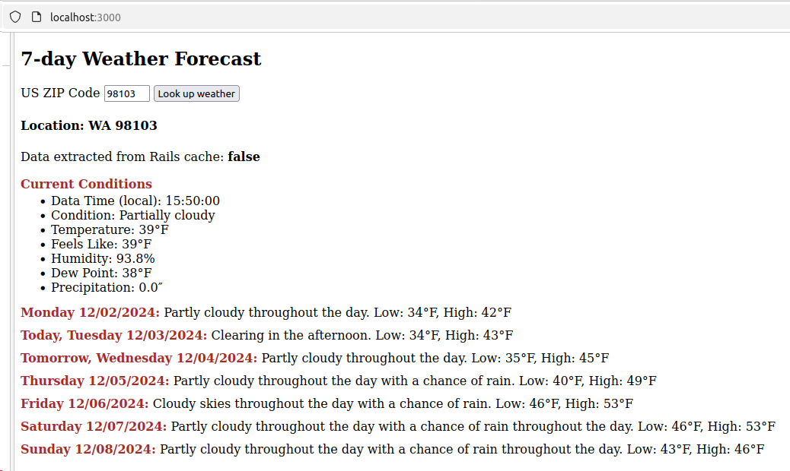

# README

This is a simple Rails application to display weather information for a user-provided US Zip Code.
Data comes from the free layer of this weather API: https://weather.visualcrossing.com/VisualCrossingWebServices/rest/services/timeline/[location]/[date1]/date2?key=YOUR_API_KEY
We show both current weather (latest info available), as well as weather forecast for 7 days including current date.

Using Ruby 3.3.6 and Rails 7.1.5.

Using hotwire's turbo stream instead of AJAX, which requires rails 7+.
In fact, being a trivial single page application, it does not include a single line of custom Javascript thanks to hotwire.
 
Encrypted API key for visualcrossing API is located in `config/credentials.yml.enc`.

The application passes all rubocop/rspec/brakeman checks.

We have only one static model (named ZipCode) which is based on zip_codes table.
It is included for the sole purpose of NOT invoking the API if user enters an zip code that does not exist, e.g, 00000.
If a zip code is missing from this table, the application will say this zip code is invalid.

IMPORTANT!!!
    I have included only two zip codes in the `20241129041054_populate_zip_codes.rb` migration, which should be sufficient for the demo purposes:
        07410 (Fair Lawn, NJ) and 98109 (Queen Ann in Seattle).

    ANY OTHER ZIP CODE WILL BE FLAFFED AS INVALID because I do not want arbitrary people to be able to use the application
    which is located in a public github repository (If a certain threshold is exceeded, visualcrossing will start charging my account).
    However, I have all US zip codes loaded in my local database, and I will be able to demonstrate it if we have a chance to meet online.

This is how it looks:

