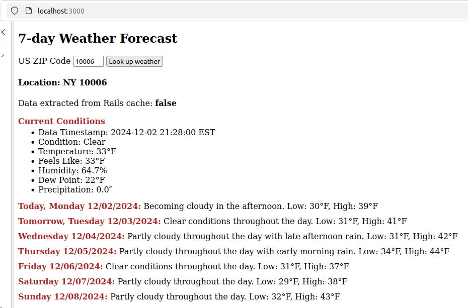

# README

This is a simple Rails application to display weather information for a user-provided US Zip Code.
Data comes from the free layer of this weather API: https://weather.visualcrossing.com/VisualCrossingWebServices/rest/services/timeline/[location]/[date1]/date2?key=YOUR_API_KEY .
We show both current weather (latest info available), as well as weather forecast for 7 days including current date.

Using Ruby 3.3.6 and Rails 7.1.5.

Using hotwire turbo stream instead of AJAX, which requires rails 7+.
In fact, being a trivial single page application, it does not include a single line of custom Javascript thanks to hotwire.

Encrypted API key for visualcrossing API is located in `config/credentials.yml.enc`.

The application passes all rubocop/rspec/brakeman checks.

We have only one static model (named ZipCode) which is based on zip_codes table.
It is included for two reasons:
- We do not want to invoke the API unless we know that the entered zip code is valid (e.g., not 00001, etc).
- Dates that we pass to the service need to be in TZ of the desired location, as opposed to server's TZ.

If a zip code is missing from this table, the application will say this zip code is invalid without invoking the API.

**_IMPORTANT_**:
I have included only two zip codes in the `20241129041054_populate_zip_codes.rb` migration, which should be sufficient for the demo purposes:
- 07410 (Fair Lawn, NJ),
- 98109 (Queen Ann in Seattle).

ANY OTHER ZIP CODE WILL BE FLAGGED AS INVALID because I do not want public to be able to use the application
which is located in a public github repository (If a certain threshold is exceeded, visualcrossing will start charging my account).
However, I have all US zip codes loaded in my local database, and I will be able to demonstrate it if we have a chance to meet online.

This is how it looks:

